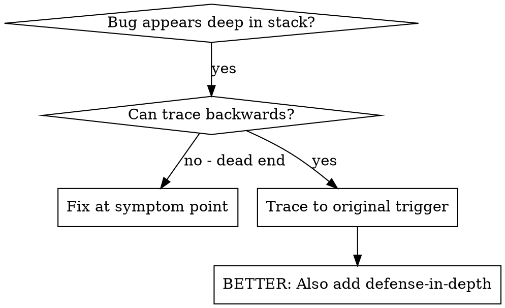
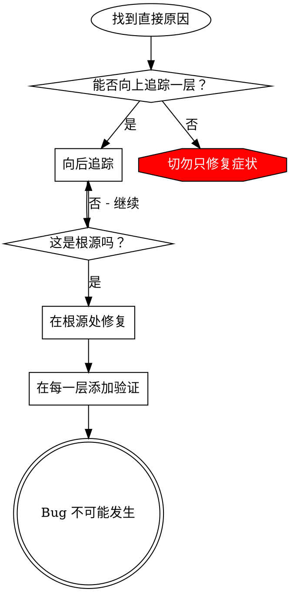

# 根源追溯

## 概述

Bug 往往在调用栈深处显现（在错误目录执行 git init、文件创建在错误位置、使用错误路径打开数据库）。你的直觉是在错误出现的地方修复，但这只是治标。

**核心原则：** 沿着调用链向后追溯，直到找到最初的触发点，然后在源头修复。

## 何时使用



**在以下情况使用：**

* 错误发生在执行深处（而非入口点）
* 堆栈跟踪显示很长的调用链
* 不清楚无效数据源自何处
* 需要找出哪个测试/代码触发了问题

## 追溯流程

### 1. 观察症状

```
错误：在 /Users/jesse/project/packages/core 中执行 git init 失败
```

### 2. 找到直接原因

**是什么代码直接导致了这个问题？**

```typescript
await execFileAsync('git', ['init'], { cwd: projectDir });
```

### 3. 提问：是谁调用了它？

```typescript
WorktreeManager.createSessionWorktree(projectDir, sessionId)
  → called by Session.initializeWorkspace()
  → called by Session.create()
  → called by test at Project.create()
```

### 4. 持续向上追溯

**传递了什么值？**

* `projectDir = ''`（空字符串！）
* 空字符串作为 `cwd` 解析为 `process.cwd()`
* 那就是源代码目录！

### 5. 找到原始触发点

**空字符串从何而来？**

```typescript
const context = setupCoreTest(); // Returns { tempDir: '' }
Project.create('name', context.tempDir); // Accessed before beforeEach!
```

## 添加堆栈跟踪

当无法手动追溯时，添加检测代码：

```typescript
// Before the problematic operation
async function gitInit(directory: string) {
  const stack = new Error().stack;
  console.error('DEBUG git init:', {
    directory,
    cwd: process.cwd(),
    nodeEnv: process.env.NODE_ENV,
    stack,
  });

  await execFileAsync('git', ['init'], { cwd: directory });
}
```

**关键：** 在测试中使用 `console.error()`（不要使用 logger - 可能不会显示）

**运行并捕获：**

```bash
npm test 2>&1 | grep 'DEBUG git init'
```

**分析堆栈跟踪：**

* 查找测试文件名
* 找到触发调用的行号
* 识别模式（相同的测试？相同的参数？）

## 找出导致污染的测试

如果某问题在测试期间出现，但不知道是哪个测试导致的：

使用此目录中的二分查找脚本 `find-polluter.sh`：

```bash
./find-polluter.sh '.git' 'src/**/*.test.ts'
```

逐个运行测试，在第一个污染者处停止。查看脚本了解用法。

## 实际示例：空 projectDir

**症状：** `.git` 在 `packages/core/` 中创建（源代码目录）

**追溯链：**

1. `git init` 在 `process.cwd()` 中运行 ← 空的 cwd 参数
2. WorktreeManager 被调用时带有空的 projectDir
3. Session.create() 被传入空字符串
4. 测试在 beforeEach 之前访问了 `context.tempDir`
5. setupCoreTest() 最初返回 `{ tempDir: '' }`

**根本原因：** 顶层变量初始化时访问了空值

**修复：** 将 tempDir 改为 getter，如果在 beforeEach 之前访问则抛出错误

**同时添加纵深防御：**

* 第 1 层：Project.create() 验证目录
* 第 2 层：WorkspaceManager 验证非空
* 第 3 层：NODE\_ENV 防护拒绝在 tmpdir 外进行 git init
* 第 4 层：在 git init 前记录堆栈跟踪

## 关键原则



**切勿仅仅在错误出现的地方修复。** 追溯回去找到原始触发点。

## 堆栈跟踪技巧

**在测试中：** 使用 `console.error()` 而非 logger - logger 可能被抑制
**在操作前：** 在危险操作前记录，而不是在它失败后
**包含上下文：** 目录、cwd、环境变量、时间戳
**捕获堆栈：** `new Error().stack` 显示完整的调用链

## 实际影响

来自调试会话（2025-10-03）：

* 通过 5 级追溯找到根本原因
* 在源头修复（getter 验证）
* 添加了 4 层防御
* 1847 个测试通过，零污染
