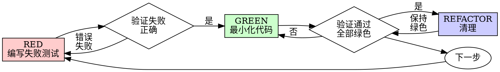

# 测试驱动开发 (TDD)

## 概述

先写测试。看着它失败。写最少的代码使其通过。

**核心原则：** 如果你没看到测试失败，你就不知道它测试的是否正确。

**违反规则的字面意思就是违反规则的精神。**

## 何时使用

**总是：**

* 新功能
* 错误修复
* 重构
* 行为变更

**例外（询问你的人类伙伴）：**

* 一次性原型
* 生成的代码
* 配置文件

想着“就这一次跳过 TDD”？停下来。那是在找借口。

## 铁律

```
NO PRODUCTION CODE WITHOUT A FAILING TEST FIRST
```

在测试之前写代码？删除它。重新开始。

**没有例外：**

* 不要把它当作“参考”保留
* 不要在编写测试时“调整”它
* 不要看它
* 删除就是删除

根据测试重新实现。完毕。

## 红-绿-重构



### 红 - 编写失败的测试

编写一个最小的测试，展示应该发生什么。

<Good>
```typescript
test('重试失败的操作3次', async () => {
  let attempts = 0;
  const operation = () => {
    attempts++;
    if (attempts < 3) throw new Error('fail');
    return 'success';
  };

const result = await retryOperation(operation);

expect(result).toBe('success');
expect(attempts).toBe(3);
});

````
Clear name, tests real behavior, one thing
</Good>

<Bad>
```typescript
test('retry works', async () => {
  const mock = jest.fn()
    .mockRejectedValueOnce(new Error())
    .mockRejectedValueOnce(new Error())
    .mockResolvedValueOnce('success');
  await retryOperation(mock);
  expect(mock).toHaveBeenCalledTimes(3);
});
````

模糊的名称，测试的是模拟对象而不是代码 </Bad>

**要求：**

* 一种行为
* 清晰的名称
* 真实代码（除非不可避免，否则不使用模拟对象）

### 验证红 - 看着它失败

**强制性的。永远不要跳过。**

```bash
npm test path/to/test.test.ts
```

确认：

* 测试失败（不是错误）
* 失败消息符合预期
* 失败是因为缺少功能（不是拼写错误）

**测试通过？** 你测试的是现有行为。修复测试。

**测试出错？** 修复错误，重新运行直到它正确失败。

### 绿 - 最少的代码

编写最简单的代码使测试通过。

<Good>
```typescript
async function retryOperation<T>(fn: () => Promise<T>): Promise<T> {
  for (let i = 0; i < 3; i++) {
    try {
      return await fn();
    } catch (e) {
      if (i === 2) throw e;
    }
  }
  throw new Error('unreachable');
}
```
刚够通过
</Good>

<Bad>
```typescript
async function retryOperation<T>(
  fn: () => Promise<T>,
  options?: {
    maxRetries?: number;
    backoff?: 'linear' | 'exponential';
    onRetry?: (attempt: number) => void;
  }
): Promise<T> {
  // YAGNI
}
```
过度工程化
</Bad>

不要添加功能、重构其他代码，或在测试范围之外进行“改进”。

### 验证绿 - 看着它通过

**强制性的。**

```bash
npm test path/to/test.test.ts
```

确认：

* 测试通过
* 其他测试仍然通过
* 输出干净（没有错误、警告）

**测试失败？** 修复代码，而不是测试。

**其他测试失败？** 立即修复。

### 重构 - 清理

仅在变绿之后：

* 消除重复
* 改进命名
* 提取辅助函数

保持测试为绿色。不要添加行为。

### 重复

为下一个功能编写下一个失败的测试。

## 好的测试

| 品质 | 好 | 坏 |
|---------|------|-----|
| **最小化** | 一件事。名字里有“和”？拆开它。 | `test('validates email and domain and whitespace')` |
| **清晰** | 名称描述行为 | `test('test1')` |
| **展示意图** | 展示期望的 API | 模糊了代码应该做什么 |

## 为什么顺序很重要

**“我会在之后写测试来验证它是否工作”**

在代码之后编写的测试会立即通过。立即通过什么也证明不了：

* 可能测试了错误的东西
* 可能测试的是实现，而不是行为
* 可能遗漏了你忘记的边缘情况
* 你从未看到它捕捉到错误

测试先行迫使你看到测试失败，证明它确实在测试某些东西。

**“我已经手动测试了所有边缘情况”**

手动测试是临时的。你以为你测试了所有东西，但是：

* 没有记录你测试了什么
* 代码变更时无法重新运行
* 压力下容易忘记用例
* “我试的时候它工作” ≠ 全面

自动化测试是系统性的。它们每次都以相同的方式运行。

**“删除 X 小时的工作是浪费”**

沉没成本谬误。时间已经花掉了。你现在可以选择：

* 删除并用 TDD 重写（再花 X 小时，高置信度）
* 保留它并在之后添加测试（30 分钟，低置信度，很可能有错误）

“浪费”在于保留了你无法信任的代码。没有真正测试的工作代码是技术债务。

**“TDD 是教条的，务实意味着适应”**

TDD 就是务实的：

* 在提交前发现错误（比事后调试更快）
* 防止回归（测试立即捕捉到破坏）
* 记录行为（测试展示如何使用代码）
* 支持重构（自由更改，测试捕捉破坏）

“务实”的捷径 = 在生产环境中调试 = 更慢。

**“事后测试能达到同样的目标——这是精神而不是仪式”**

不。事后测试回答“这做了什么？” 测试先行回答“这应该做什么？”

事后测试受你的实现影响。你测试你构建的东西，而不是需要的东西。你验证你记得的边缘情况，而不是发现的边缘情况。

测试先行迫使你在实现之前发现边缘情况。事后测试验证你是否记得所有东西（你没有）。

30 分钟的事后测试 ≠ TDD。你得到了覆盖率，但失去了证明测试有效的部分。

## 常见的合理化借口

| 借口 | 现实 |
|--------|---------|
| “太简单了，不需要测试” | 简单的代码也会出错。测试只需 30 秒。 |
| “我会事后测试” | 测试立即通过什么也证明不了。 |
| “事后测试能达到同样的目标” | 事后测试 = “这做了什么？” 测试先行 = “这应该做什么？” |
| “已经手动测试过了” | 临时的 ≠ 系统性的。没有记录，无法重新运行。 |
| “删除 X 小时是浪费” | 沉没成本谬误。保留未验证的代码是技术债务。 |
| “保留作为参考，先写测试” | 你会调整它。那就是事后测试。删除就是删除。 |
| “需要先探索一下” | 可以。扔掉探索，用 TDD 开始。 |
| “测试困难 = 设计不清晰” | 倾听测试。难以测试 = 难以使用。 |
| “TDD 会拖慢我” | TDD 比调试更快。务实 = 测试先行。 |
| “手动测试更快” | 手动测试无法证明边缘情况。每次变更你都需要重新测试。 |
| “现有代码没有测试” | 你正在改进它。为现有代码添加测试。 |

## 危险信号 - 停止并重新开始

* 先写代码后写测试
* 在实现后添加测试
* 测试立即通过
* 无法解释测试失败的原因
* 测试“稍后”添加
* 为“就这一次”找借口
* “我已经手动测试过了”
* “事后测试能达到同样的目的”
* “这是精神而不是仪式”
* “保留作为参考”或“调整现有代码”
* “已经花了 X 小时，删除是浪费”
* “TDD 是教条的，我是务实的”
* “这次不同，因为...”

**所有这些都意味着：删除代码。用 TDD 重新开始。**

## 示例：错误修复

**错误：** 接受空电子邮件

**红**

```typescript
test('rejects empty email', async () => {
  const result = await submitForm({ email: '' });
  expect(result.error).toBe('Email required');
});
```

**验证红**

```bash
$ npm test
FAIL: expected 'Email required', got undefined
```

**绿**

```typescript
function submitForm(data: FormData) {
  if (!data.email?.trim()) {
    return { error: 'Email required' };
  }
  // ...
}
```

**验证绿**

```bash
$ npm test
PASS
```

**重构**
如果需要，为多个字段提取验证逻辑。

## 验证清单

在标记工作完成之前：

* \[ ] 每个新函数/方法都有一个测试
* \[ ] 在实现之前看到每个测试失败
* \[ ] 每个测试都因预期原因失败（缺少功能，不是拼写错误）
* \[ ] 编写了最少的代码使每个测试通过
* \[ ] 所有测试通过
* \[ ] 输出干净（没有错误、警告）
* \[ ] 测试使用真实代码（仅在必要时使用模拟对象）
* \[ ] 覆盖了边缘情况和错误

无法勾选所有选项？你跳过了 TDD。重新开始。

## 遇到困难时

| 问题 | 解决方案 |
|---------|----------|
| 不知道如何测试 | 写下期望的 API。先写断言。询问你的人类伙伴。 |
| 测试太复杂 | 设计太复杂。简化接口。 |
| 必须模拟一切 | 代码耦合度太高。使用依赖注入。 |
| 测试设置庞大 | 提取辅助函数。仍然复杂？简化设计。 |

## 调试集成

发现错误？编写一个重现它的失败测试。遵循 TDD 循环。测试证明修复并防止回归。

永远不要在没有测试的情况下修复错误。

## 测试反模式

添加模拟对象或测试工具时，请阅读 @testing-anti-patterns.md 以避免常见陷阱：

* 测试模拟对象行为而不是真实行为
* 向生产类添加仅用于测试的方法
* 在不理解依赖关系的情况下进行模拟

## 最终规则

```
生产代码 → 测试存在且首先失败
否则 → 不是 TDD
```

没有你的人类伙伴的许可，不得有例外。
