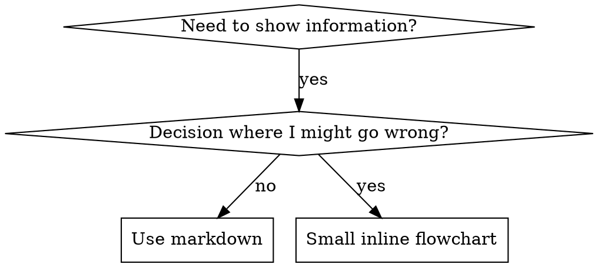

# 写作技能

## 概述

**写作技能是测试驱动开发在流程文档中的应用。**

**个人技能存放在特定智能体的目录中（`~/.claude/skills` 对应 Claude Code，`~/.agents/skills/` 对应 Codex）**

你编写测试用例（包含子智能体的压力场景），观察它们失败（基线行为），编写技能（文档），观察测试通过（智能体遵从），并进行重构（修补漏洞）。

**核心原则：** 如果你没有观察到智能体在没有该技能的情况下失败，你就不知道这个技能是否教授了正确的内容。

**必备背景：** 在使用此技能之前，你必须理解 superpowers:test-driven-development。该技能定义了基本的 RED-GREEN-REFACTOR 循环。本技能将 TDD 适配到文档编写。

**官方指导：** 关于 Anthropic 官方的技能编写最佳实践，请参阅 anthropic-best-practices.md。本文档提供了额外的模式和指南，以补充本技能中专注于 TDD 的方法。

## 什么是技能？

一个**技能**是经过验证的技术、模式或工具的参考指南。技能帮助未来的 Claude 实例找到并应用有效的方法。

**技能是：** 可复用的技术、模式、工具、参考指南

**技能不是：** 关于你如何一次性解决问题的叙述

## 技能的 TDD 映射

| TDD 概念 | 技能创建 |
|-------------|----------------|
| **测试用例** | 包含子智能体的压力场景 |
| **生产代码** | 技能文档 (SKILL.md) |
| **测试失败 (RED)** | 智能体在没有技能时违反规则（基线） |
| **测试通过 (GREEN)** | 智能体在有技能时遵从 |
| **重构** | 在保持遵从的同时修补漏洞 |
| **先写测试** | 在编写技能之前运行基线场景 |
| **观察失败** | 记录智能体使用的确切合理化解释 |
| **最简代码** | 编写针对那些特定违规行为的技能 |
| **观察通过** | 验证智能体现在遵从 |
| **重构循环** | 发现新的合理化解释 → 修补 → 重新验证 |

整个技能创建过程遵循 RED-GREEN-REFACTOR 循环。

## 何时创建技能

**在以下情况下创建：**

* 该技术对你来说并非直观明显
* 你会在不同项目中再次参考此内容
* 模式广泛适用（非项目特定）
* 其他人会受益

**不要为以下情况创建：**

* 一次性解决方案
* 其他地方已有完善文档的标准实践
* 项目特定的约定（放在 CLAUDE.md 中）
* 机械性约束（如果可以用正则表达式/验证强制执行，就自动化它——把文档留给需要判断的情况）

## 技能类型

### 技术

具有可遵循步骤的具体方法（条件等待、根本原因追踪）

### 模式

思考问题的方式（使用标志扁平化、测试不变量）

### 参考

API 文档、语法指南、工具文档（办公文档）

## 目录结构

```
skills/
  skill-name/
    SKILL.md              # 主要参考文件（必需）
    supporting-file.*     # 仅在需要时添加
```

**扁平命名空间** - 所有技能在一个可搜索的命名空间中

**为以下内容使用单独文件：**

1. **重型参考** (100+ 行) - API 文档、综合语法
2. **可复用工具** - 脚本、实用程序、模板

**内联保留：**

* 原则和概念
* 代码模式 (< 50 行)
* 其他所有内容

## SKILL.md 结构

**前言 (YAML):**

* 两个必填字段：`name` 和 `description`（所有支持的字段请参见 [agentskills.io/specification](https://agentskills.io/specification)）
* 总字符数最多 1024 个
* `name`：仅使用字母、数字和连字符（不能使用括号、特殊字符）
* `description`：使用第三人称，仅描述何时使用（而非其功能）
  * 以“在以下情况使用...”开头，聚焦于触发条件
  * 包含具体的症状、情境和上下文
  * **切勿总结技能的流程或工作流**（原因请参见 CSO 部分）
  * 如果可能，保持在 500 个字符以内

```markdown
---
name: Skill-Name-With-Hyphens
description: Use when [specific triggering conditions and symptoms]
---

# 技能名称

## 概述
这是什么？用 1-2 句话说明核心原理。

## 何时使用
[如果决策不明显，可包含小型内联流程图]

以项目符号列出症状和使用场景
何时不应使用

## 核心模式（适用于技术/模式）
前后代码对比

## 快速参考
用于快速浏览常见操作的表格或项目符号列表

## 实现
简单模式的内联代码
指向重型参考或可复用工具文件的链接

## 常见错误
问题所在 + 修复方法

## 实际影响（可选）
具体成果
```

## Claude 搜索优化 (CSO)

**对可发现性至关重要：** 未来的 Claude 需要能够找到你的技能

### 1. 丰富的描述字段

**目的：** Claude 通过读取描述来决定为给定任务加载哪些技能。让它回答：“我现在应该阅读这个技能吗？”

**格式：** 以“Use when...”开头，专注于触发条件

**关键：描述 = 何时使用，而非技能的作用**

描述应仅描述触发条件。切勿在描述中总结技能的过程或工作流。

**这很重要：** 测试显示，当描述总结了技能的工作流时，Claude 可能会遵循描述而不是阅读完整的技能内容。一个描述写着“任务间的代码审查”导致 Claude 只进行一次审查，即使技能的流程图清楚地显示了两次审查（规范符合性审查然后是代码质量审查）。

当描述改为仅“Use when executing implementation plans with independent tasks”（无工作流总结）时，Claude 正确地阅读了流程图并遵循了两阶段审查过程。

**陷阱：** 总结工作流的描述创建了 Claude 会走的捷径。技能主体变成了 Claude 会跳过的文档。

```yaml
# ❌ BAD: Summarizes workflow - Claude may follow this instead of reading skill
description: Use when executing plans - dispatches subagent per task with code review between tasks

# ❌ BAD: Too much process detail
description: Use for TDD - write test first, watch it fail, write minimal code, refactor

# ✅ GOOD: Just triggering conditions, no workflow summary
description: Use when executing implementation plans with independent tasks in the current session

# ✅ GOOD: Triggering conditions only
description: Use when implementing any feature or bugfix, before writing implementation code
```

**内容：**

* 使用具体的触发器、症状和情况来表明此技能适用
* 描述*问题*（竞态条件、不一致行为），而非*特定语言的症状*（setTimeout、sleep）
* 保持触发器与技术无关，除非技能本身是技术特定的
* 如果技能是技术特定的，请在触发器中明确说明
* 用第三人称书写（注入到系统提示中）
* **切勿总结技能的过程或工作流**

```yaml
# ❌ BAD: Too abstract, vague, doesn't include when to use
description: For async testing

# ❌ BAD: First person
description: I can help you with async tests when they're flaky

# ❌ BAD: Mentions technology but skill isn't specific to it
description: Use when tests use setTimeout/sleep and are flaky

# ✅ GOOD: Starts with "Use when", describes problem, no workflow
description: Use when tests have race conditions, timing dependencies, or pass/fail inconsistently

# ✅ GOOD: Technology-specific skill with explicit trigger
description: Use when using React Router and handling authentication redirects
```

### 2. 关键词覆盖

使用 Claude 会搜索的词语：

* 错误消息：“Hook timed out”、“ENOTEMPTY”、“race condition”
* 症状：“flaky”、“hanging”、“zombie”、“pollution”
* 同义词：“timeout/hang/freeze”、“cleanup/teardown/afterEach”
* 工具：实际命令、库名、文件类型

### 3. 描述性命名

**使用主动语态，动词优先：**

* ✅ `creating-skills` 而非 `skill-creation`
* ✅ `condition-based-waiting` 而非 `async-test-helpers`

### 4. 令牌效率（关键）

**问题：** 入门指南和频繁引用的技能会加载到每一次对话中。每个令牌都很重要。

**目标字数：**

* 入门指南工作流：每项 <150 词
* 频繁加载的技能：总计 <200 词
* 其他技能：<500 词（仍需简洁）

**技巧：**

**将细节移至工具帮助：**

```bash
# ❌ BAD: Document all flags in SKILL.md
search-conversations supports --text, --both, --after DATE, --before DATE, --limit N

# ✅ GOOD: Reference --help
search-conversations supports multiple modes and filters. Run --help for details.
```

**使用交叉引用：**

```markdown
# ❌ 不佳做法：重复工作流细节
搜索时，使用模板派生子代理...
[20行重复的指令]

# ✅ 良好做法：引用其他技能
始终使用子代理（可节省50-100倍上下文）。必需：使用 [其他技能名称] 来处理工作流。
```

**压缩示例：**

```markdown
# ❌ 反面示例：冗长版本（42词）
你的搭档："我们之前是如何在 React Router 中处理认证错误的？"
你：我来搜索过往对话中关于 React Router 认证模式的内容。
[派发子代理，搜索查询："React Router authentication error handling 401"]

# ✅ 正面示例：简洁版本（20词）
搭档："React Router 里之前怎么处理认证错误？"
你：搜索中...
[派发子代理 → 综合处理]
```

**消除冗余：**

* 不要重复交叉引用技能中的内容
* 不要解释命令中显而易见的内容
* 不要包含同一模式的多个示例

**验证：**

```bash
wc -w skills/path/SKILL.md
# getting-started workflows: aim for <150 each
# Other frequently-loaded: aim for <200 total
```

**按你所做的或核心见解命名：**

* ✅ `condition-based-waiting` > `async-test-helpers`
* ✅ `using-skills` 而非 `skill-usage`
* ✅ `flatten-with-flags` > `data-structure-refactoring`
* ✅ `root-cause-tracing` > `debugging-techniques`

**动名词 (-ing) 适用于描述过程：**

* `creating-skills`、`testing-skills`、`debugging-with-logs`
* 主动，描述你正在采取的行动

### 4. 交叉引用其他技能

**在编写引用其他技能的文档时：**

仅使用技能名称，并带有明确的需求标记：

* ✅ 好：`**REQUIRED SUB-SKILL:** Use superpowers:test-driven-development`
* ✅ 好：`**REQUIRED BACKGROUND:** You MUST understand superpowers:systematic-debugging`
* ❌ 不好：`See skills/testing/test-driven-development`（不清楚是否必需）
* ❌ 不好：`@skills/testing/test-driven-development/SKILL.md`（强制加载，消耗上下文）

**为何不使用 @ 链接：** `@` 语法会立即强制加载文件，在你需要它们之前就消耗 200k+ 的上下文。

## 流程图使用



**仅在以下情况使用流程图：**

* 非显而易见的决策点
* 你可能过早停止的流程循环
* “何时使用 A 与 B”的决策

**切勿为以下情况使用流程图：**

* 参考材料 → 表格、列表
* 代码示例 → Markdown 代码块
* 线性指令 → 编号列表
* 无语义含义的标签（step1、helper2）

关于 graphviz 样式规则，请参阅 @graphviz-conventions.dot。

**为你的合作伙伴可视化：** 使用此目录中的 `render-graphs.js` 将技能的流程图渲染为 SVG：

```bash
./render-graphs.js ../some-skill           # Each diagram separately
./render-graphs.js ../some-skill --combine # All diagrams in one SVG
```

## 代码示例

**一个优秀的示例胜过多个平庸的示例**

选择最相关的语言：

* 测试技术 → TypeScript/JavaScript
* 系统调试 → Shell/Python
* 数据处理 → Python

**好的示例：**

* 完整且可运行
* 注释良好，解释原因
* 来自真实场景
* 清晰地展示模式
* 便于改编（非通用模板）

**不要：**

* 用 5 种以上语言实现
* 创建填空模板
* 编写人为的示例

你很擅长移植——一个优秀的示例就足够了。

## 文件组织

### 自包含的技能

```
defense-in-depth/
  SKILL.md    # 所有内容均内联
```

何时使用：所有内容都合适，无需重型参考

### 带有可复用工具的技能

```
condition-based-waiting/
  SKILL.md    # 概述 + 模式
  example.ts  # 可用的辅助函数，供调整使用
```

何时使用：工具是可复用代码，而不仅仅是叙述

### 带有重型参考的技能

```
pptx/
  SKILL.md       # 概述 + 工作流程
  pptxgenjs.md   # 600行 API 参考
  ooxml.md       # 500行 XML 结构
  scripts/       # 可执行工具
```

何时使用：参考材料太大，不适合内联

## 铁律（与 TDD 相同）

```
没有失败的测试，就没有技能。
```

这适用于新技能和对现有技能的编辑。

在测试前编写技能？删除它。重新开始。
未经测试就编辑技能？同样的违规。

**无例外：**

* 不适用于“简单添加”
* 不适用于“只是添加一个部分”
* 不适用于“文档更新”
* 不要将未经测试的更改保留为“参考”
* 不要在运行测试时“调整”
* 删除就是删除

**必备背景：** superpowers:test-driven-development 技能解释了这为何重要。同样的原则适用于文档。

## 测试所有技能类型

不同的技能类型需要不同的测试方法：

### 纪律强化型技能（规则/要求）

**示例：** TDD、完成前验证、编码前设计

**测试方法：**

* 学术性问题：他们理解规则吗？
* 压力场景：他们在压力下遵守吗？
* 多重压力组合：时间 + 沉没成本 + 疲惫
* 识别合理化解释并添加明确的应对措施

**成功标准：** 智能体在最大压力下遵守规则

### 技术型技能（操作指南）

**示例：** 条件等待、根本原因追踪、防御性编程

**测试方法：**

* 应用场景：他们能正确应用该技术吗？
* 变体场景：他们能处理边缘情况吗？
* 缺失信息测试：指令是否存在空白？

**成功标准：** 智能体成功将技术应用于新场景

### 模式型技能（心智模型）

**示例：** 降低复杂性、信息隐藏概念

**测试方法：**

* 识别场景：他们能识别何时适用该模式吗？
* 应用场景：他们能使用该心智模型吗？
* 反例：他们知道何时不应应用吗？

**成功标准：** 智能体正确识别何时/如何应用模式

### 参考型技能（文档/API）

**示例：** API 文档、命令参考、库指南

**测试方法：**

* 检索场景：他们能找到正确的信息吗？
* 应用场景：他们能正确应用找到的信息吗？
* 空白测试：常见用例是否涵盖？

**成功标准：** 智能体找到并正确应用参考信息

## 跳过测试的常见合理化解释

| 借口 | 现实 |
|--------|---------|
| “技能显然很清晰” | 对你清晰 ≠ 对其他智能体清晰。测试它。 |
| “这只是个参考” | 参考可能存在空白、不清晰的段落。测试检索。 |
| “测试过度了” | 未经测试的技能存在问题。总是如此。15 分钟测试能节省数小时。 |
| “如果出现问题我会测试” | 问题 = 智能体无法使用技能。在部署前测试。 |
| “测试太繁琐” | 测试比在生产中调试坏技能要省事。 |
| “我确信它很好” | 过度自信必然导致问题。无论如何都要测试。 |
| “学术审查足够了” | 阅读 ≠ 使用。测试应用场景。 |
| “没时间测试” | 部署未经测试的技能会浪费更多时间在以后修复它。 |

**所有这些都意味着：在部署前测试。没有例外。**

## 让技能对合理化免疫

强制纪律的技能（如 TDD）需要能够抵抗合理化。代理很聪明，在压力下会寻找漏洞。

**心理学注记：** 理解说服技巧为何有效，有助于你系统地应用它们。关于权威、承诺、稀缺性、社会认同和统一性原则的研究基础，请参阅 persuasion-principles.md（Cialdini, 2021; Meincke et al., 2025）。

### 明确堵住每一个漏洞

不要仅仅陈述规则——要禁止特定的变通方法：

<Bad>
```markdown
在测试前编写代码？删除它。
```
</Bad>

<Good>
```markdown
编写代码之前进行测试？删除它。重新开始。

**无例外：**

* 不要将其保留为“参考”
* 不要在编写测试时“借鉴”它
* 不要看它
* 删除就是删除

````
</Good>

### 处理“精神与字面”的争论

尽早添加基本原则：

```markdown
**违反规则的字面意思就是违反规则的精神。**

````

这切断了整个“我遵循了精神”的合理化类别。

### 建立合理化对照表

从基线测试中捕捉合理化行为（见下文测试部分）。代理提出的每一个借口都要记录在表中：

```markdown
| 借口 | 现实 |
|--------|---------|
| "太简单了，不需要测试" | 简单的代码也会出错。测试只需30秒。 |
| "我稍后再测试" | 测试通过立刻证明不了什么。 |
| "之后测试也能达到相同目标" | 测试后补 = "这段代码是做什么的？" 测试先行 = "这段代码应该做什么？" |
```

### 创建危险信号列表

让代理在合理化时容易进行自我检查：

```markdown
## 危险信号 - 立即停止并重新开始

- 先写代码后测试
- “我已经手动测试过了”
- “之后再测试效果也一样”
- “重要的是精神而不是形式”
- “这次情况特殊，因为……”

**以上任何一条都意味着：删除代码，用测试驱动开发重新开始。**
```

### 为违规征兆更新 CSO

在描述中添加：当你即将违反规则时的征兆：

```yaml
description: use when implementing any feature or bugfix, before writing implementation code
```

## 技能的“红-绿-重构”流程

遵循 TDD 循环：

### 红：编写失败测试（基线）

在没有该技能的情况下，使用子代理运行压力场景。记录确切行为：

* 他们做出了哪些选择？
* 他们使用了哪些合理化借口（逐字记录）？
* 哪些压力触发了违规？

这就是“观察测试失败”——在编写技能之前，你必须先看看代理的自然行为。

### 绿：编写最小化技能

编写能解决这些特定合理化借口的技能。不要为假设性案例添加额外内容。

使用技能运行相同场景。代理现在应该遵守规则。

### 重构：堵住漏洞

代理找到了新的合理化借口？添加明确的应对措施。重新测试直到无懈可击。

**测试方法论：** 完整的测试方法论请参阅 @testing-skills-with-subagents.md：

* 如何编写压力场景
* 压力类型（时间、沉没成本、权威、疲劳）
* 系统地堵住漏洞
* 元测试技术

## 反模式

### ❌ 叙事性示例

“在 2025-10-03 的会话中，我们发现空的 projectDir 导致了……”
**为何不好：** 过于具体，不可复用

### ❌ 多语言稀释

example-js.js, example-py.py, example-go.go
**为何不好：** 质量平庸，维护负担重

### ❌ 流程图中的代码

```dot
step1 [label="import fs"];
step2 [label="read file"];
```

**为何不好：** 无法复制粘贴，难以阅读

### ❌ 通用标签

helper1, helper2, step3, pattern4
**为何不好：** 标签应具有语义含义

## 停：在转向下一个技能之前

**编写完任何技能后，你必须停下来完成部署流程。**

**不要：**

* 批量创建多个技能而不测试每一个
* 在当前技能验证完成前转向下一个技能
* 以“批量处理更高效”为由跳过测试

**下面的部署清单对每个技能都是强制性的。**

部署未经测试的技能 = 部署未经测试的代码。这违反了质量标准。

## 技能创建清单（适配自 TDD）

**重要提示：使用 TodoWrite 为下面的每个清单项创建待办事项。**

**红阶段 - 编写失败测试：**

* \[ ] 创建压力场景（针对纪律性技能，需包含 3 种以上复合压力）
* \[ ] 在没有技能的情况下运行场景——逐字记录基线行为
* \[ ] 识别合理化/失败的模式

**绿阶段 - 编写最小化技能：**

* \[ ] 名称仅使用字母、数字、连字符（不能使用括号/特殊字符）
* \[ ] YAML 前言包含必填的 `name` 和 `description` 字段（最多 1024 个字符；参见[规范](https://agentskills.io/specification)）
* \[ ] 描述以“在以下情况使用...”开头，并包含具体的触发条件/症状
* \[ ] 描述使用第三人称
* \[ ] 全文包含用于搜索的关键词（错误、症状、工具）
* \[ ] 概述清晰，包含核心原则
* \[ ] 解决 RED 中识别的具体基线故障
* \[ ] 代码内联或链接到单独的文件
* \[ ] 提供一个优秀的示例（非多语言）
* \[ ] 运行包含该技能的场景 - 验证代理现在是否合规

**重构阶段 - 堵住漏洞：**

* \[ ] 从测试中识别新的合理化借口
* \[ ] 添加明确的应对措施（如果是纪律性技能）
* \[ ] 根据所有测试迭代建立合理化对照表
* \[ ] 创建危险信号列表
* \[ ] 重新测试直到无懈可击

**质量检查：**

* \[ ] 仅在决策不明显时使用小型流程图
* \[ ] 快速参考表
* \[ ] 常见错误部分
* \[ ] 没有叙事性描述
* \[ ] 支持文件仅用于工具或大量参考

**部署：**

* \[ ] 将技能提交到 git 并推送到你的分支（如果已配置）
* \[ ] 考虑通过 PR 贡献回来（如果具有广泛用途）

## 发现工作流

未来的 Claude 如何找到你的技能：

1. **遇到问题**（“测试不稳定”）
2. **找到技能**（描述匹配）
3. **浏览概述**（这相关吗？）
4. **阅读模式**（快速参考表）
5. **加载示例**（仅在实施时）

**针对此流程进行优化**——尽早并经常放置可搜索的术语。

## 核心要点

**创建技能就是流程文档的 TDD。**

同样的铁律：没有失败的测试，就没有技能。
同样的循环：红（基线）→ 绿（编写技能）→ 重构（堵住漏洞）。
同样的好处：更好的质量，更少的意外，无懈可击的结果。

如果你为代码遵循 TDD，那么也为技能遵循它。这是应用于文档的同一种纪律。
